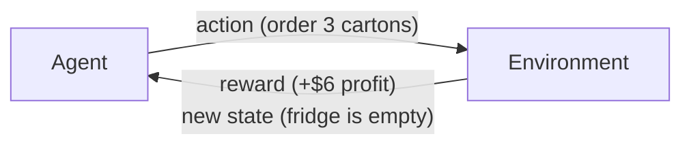

# 01 · What Is Reinforcement Learning?

*Part 1 — The Problem · ~10 min read · Based on Ch. 1, 2 and 9.1 of* Reinforcement Learning: Foundations *(Mannor, Mansour, Tamar)*

---

## 1. Motivation: some decisions only pay off later

You run a small coffee shop. Every evening you decide how many cartons of milk to order for tomorrow.

- Order too little: you turn customers away.
- Order too much: the extra milk spoils and you wasted money.
- And the catch: **you pay for the milk today, but you only earn money tomorrow.**

If you judged tonight's decision only by tonight's bank balance, ordering nothing would always look best. You'd spend \$0 tonight, and then have nothing to sell tomorrow.

That's the kind of problem reinforcement learning (RL) is about. The book defines it in one sentence:

> **Reinforcement learning is learning and acting in environments where decisions are made one after another, so each decision has to account for its effect on the decisions that follow.**

Many problems look like this:

| Problem | Decision | Why "later" matters |
|---|---|---|
| Chess, Go, backgammon | Which move to play | A move that looks bad now can win the game 30 moves later |
| Robot arm | What voltage to send to each motor | A small jerk now can knock the cup over a second later |
| Inventory (our coffee shop) | How much stock to order | Money leaves today, and sales come tomorrow |
| Chatbot | Which word to write next | Each word shapes whether the whole answer ends up helpful |

---

## 2. The core idea without math

Every RL problem has two characters:

- **The agent** is the decision maker: you, the robot, or the chess program.
- **The environment** is everything else: customers, physics, the opponent.

They take turns in a loop:



1. The agent looks at the **state**: the situation right now, such as how much milk is in the fridge.
2. It picks an **action**: order 0, 1, 2, … cartons.
3. The environment answers with a **reward**, a single number saying how good that step was (today's profit).
4. The environment also moves to a **new state**, and the loop repeats.

The agent's goal is **not** to get the biggest reward on the next step. **It wants the biggest total reward over time.** Everything in RL follows from that goal.

### How is this different from "normal" machine learning?

In supervised learning, such as teaching a model to spot cats in photos, every training example comes with the right answer: *"this photo is a cat."*

RL gets no right answers. Nobody tells the coffee-shop owner *"the correct order was 3."* All the owner sees is how the day went: *"you made \$6."* The agent has to work out which of its choices led to that result.

| | Supervised learning | Reinforcement learning |
|---|---|---|
| Feedback | The correct answer | A score (reward) |
| Do your choices change the next input? | No, photos don't care what you predicted | **Yes**, today's order changes tomorrow's fridge |
| Main difficulty | Generalizing to new examples | Delayed consequences, plus deciding what to try |

---

## 3. Mathematical formulation

We only need a little notation for now. Time moves in steps $t = 0, 1, 2, \dots$ (days, in our shop).

| Symbol | Read it as | Coffee shop |
|---|---|---|
| $s_t$ | state at step $t$ | milk in the fridge on day $t$ |
| $a_t$ | action at step $t$ | cartons ordered on day $t$ |
| $r_t$ | reward at step $t$ | profit on day $t$ |
| $T$ | horizon, meaning how many steps we care about | e.g. 30 days |

The quantity the agent tries to make as large as possible is the **return**, the sum of all rewards:

$$
G \;=\; r_0 + r_1 + r_2 + \dots + r_{T-1} \;=\; \sum_{t=0}^{T-1} r_t
$$

When the world is random (customers are unpredictable), the same actions can lead to different returns. So we maximize the **expected** return, the average over all the ways things could turn out:

$$
\text{goal:}\quad \text{maximize } \; \mathbb{E}\big[\,G\,\big]
$$

---

## 4. Understanding the equation

- **$\sum_{t=0}^{T-1} r_t$** means "add up the rewards from step 0 to step $T-1$." Every step counts, not just the first.
- **$\mathbb{E}[\cdot]$** ("expected value") means "the average you'd get if you replayed this situation many times." It's the fair way to compare two plans when luck is involved.
- The return adds up rewards. **Grabbing a small reward now can cost you a larger one later**, and the sum records that trade-off.

> **Coming later:** we will add one more ingredient, a *discount factor* $\gamma$, which makes rewards far in the future count a bit less: $G = r_0 + \gamma r_1 + \gamma^2 r_2 + \dots$ We don't need it yet.

---

## 5. Where does the formulation come from? (the assumptions)

The book's main model is called a **Markov Decision Process (MDP)**. Post 05 covers it in depth. For now, here is the list of simplifications it makes, in plain words:

1. **Time moves in steps** (every day, every second), not continuously.
2. **There are a limited number of states and actions** (the fridge holds 0–10 cartons, you can order 0–10).
3. **The reward is a single number.** Everything you care about has to be squeezed into one "currency."
4. **The Markov property:** what happens next depends only on the *current* state and action, not on the whole history. If the fridge contents tell you everything you need, you don't need last month's diary.
5. **The rules of the world don't change** (customers behave randomly, but always according to the same odds).

The book quotes the statistician George Box: *"All models are wrong, but some are useful."* Real problems break some of these rules, and the MDP is still useful.

---

## 6. Intuition: three kinds of "I don't know"

The book lists three kinds of uncertainty an agent can face. The names are fancy, but the ideas are simple:

| Type | Meaning | Coffee shop | Handled by |
|---|---|---|---|
| **Aleatoric** (Latin *alea*, "dice") | Randomness built into the world | Customers show up at random | MDP (planning posts) |
| **Epistemic** (Greek *episteme*, "knowledge") | You don't know the odds yet | Brand-new shop: is typical demand 1 carton or 30? | **Learning** (RL posts) |
| **Partial observability** | You can't see the whole state | A carton at the back of the fridge that you forgot about | Beyond this series |

This table also explains how the book (and this series) is organized:

```text
 PLANNING                                   LEARNING
 "I know the odds of the dice.              "I don't know the odds.
  What's the best strategy?"                 I have to find out by trying."
        │                                          │
        ▼                                          ▼
   Posts 02–06                                Posts 07–12
```

Learning brings a new dilemma of its own: **explore or exploit?** Do you stick with the order size that has worked so far, or try a different one to see if it's better? Post 07 is about that trade-off.

---

## 7. Visualization: short-term vs long-term

Tomorrow's demand is exactly 2 cartons. Each carton costs \$1 today and sells for \$3 tomorrow. Leftovers spoil.

```text
                 Tonight        Tomorrow        Total (return)
                ─────────      ─────────       ──────────────
Order 0 cartons    $0             $0                $0      ← best "tonight"
Order 1 carton    −$1            +$3               +$2
Order 2 cartons   −$2            +$6               +$4      ← best overall
Order 3 cartons   −$3            +$6               +$3
```

If you only look at tonight's reward, you order 0. Once you add up the whole return, you order 2. **Choosing actions by the return instead of the immediate reward is the core idea of RL.**

---

## 8. Numerical example: adding luck

Now make tomorrow uncertain: demand is **1 carton** or **3 cartons**, each with 50% probability. Profit for one day is

$$
r = 3 \cdot \min(\text{order},\ \text{demand}) \;-\; 1 \cdot \text{order}
$$

(you can't sell more than you ordered, or more than customers want).

| Order | Profit if demand = 1 | Profit if demand = 3 | Expected profit |
|---:|---:|---:|---:|
| 0 | 0 | 0 | **0.0** |
| 1 | 3·1 − 1 = **2** | 3·1 − 1 = **2** | **2.0** |
| 2 | 3·1 − 2 = **1** | 3·2 − 2 = **4** | **2.5** |
| 3 | 3·1 − 3 = **0** | 3·3 − 3 = **6** | **3.0** (best) |
| 4 | 3·1 − 4 = **−1** | 3·3 − 4 = **5** | **2.0** |

Example calculation for "order 3": $\;0.5 \times 0 + 0.5 \times 6 = 3.0$

Two things to notice:

1. **Best on average is not the same as safe.** Ordering 3 has the highest expected profit, but on half the days you make \$0. Ordering 1 always makes exactly \$2. Standard RL maximizes the *average*. If you care about risk, you need a different objective (the book mentions this as a limitation).
2. Here we *knew* the 50/50 odds, so we could just calculate the answer. That's **planning**. A new shop owner wouldn't know the odds and would have to discover them by ordering and watching what happens. That's **learning**.

---

## 9. Practical implementation: the loop in code

The whole agent–environment loop fits in a few lines. The full script is in [`code/01_coffee_shop.py`](code/01_coffee_shop.py).

```python
import random

def environment_step(order):
    demand = random.choice([1, 3])          # the world rolls its dice
    sold = min(order, demand)
    return 3 * sold - 1 * order             # reward = today's profit

def run(policy, days=10_000):
    total = 0
    for _ in range(days):
        action = policy()                   # agent decides
        total += environment_step(action)   # environment responds with a reward
    return total / days                     # average reward per day

for order in range(5):
    print(f"always order {order}: {run(lambda: order):+.2f}")
```

Output (average profit per day):

```text
always order 0: +0.00
always order 1: +2.00
always order 2: +2.49
always order 3: +2.99    ← matches the 3.0 we calculated by hand
always order 4: +1.99
```

The simulator never told the agent the odds, yet trying each option many times still points to "order 3." That's the basic idea behind *learning from experience*. It's also why nearly all RL successes (games, robots) were trained in **simulators**, where trying millions of times is cheap.

---

## 10. Where RL has worked

- **1962:** Arthur Samuel's checkers program reached the level of the best human players.
- **1992:** *TD-Gammon* learned backgammon by playing against itself. It found an opening move that experts later adopted.
- **2013–2016:** DeepMind's agents learned Atari games from raw pixels, and *AlphaGo* beat the world's best Go players.
- **Today:** RL is used to fine-tune large language models so that their answers match what people prefer (*RL from Human Feedback*, RLHF).

These systems looked very different from each other. The book points out that underneath, the models and algorithmic ideas were *surprisingly similar*. This series is about those shared foundations.

---

## 11. Limitations (things to keep in mind)

- **Designing the reward is hard.** How do you give a robot a score for "folded the shirt neatly"? The reward is a *design choice*, and a badly designed reward gets you badly designed behaviour.
- **Rewards can be rare.** In chess the only reward comes at the very end (win or lose). The agent has to work out which of its 40 moves deserve the credit.
- **One number may not be enough.** Real goals often conflict: "save power *and* be fast." Squeezing them into one reward is like adding apples and oranges.
- **Average isn't everything.** Maximizing expected return ignores risk, as the "order 3" example showed.

---

## Key takeaways

1. **RL is about sequences of decisions**, where what you do now changes what happens later.
2. An **agent** takes **actions** in an **environment**, and in return gets **rewards** and a new **state**.
3. The goal is to maximize the **return**, the (expected) *total* reward, not the next reward.
4. **Planning** means finding the best strategy when you know how the world works. **Learning** means finding it when you don't.
5. The standard model behind all of this is the **Markov Decision Process**.

---

## Connection to the bigger picture

We've been saying "strategy" loosely. RL has a precise name for it: a **policy**, a rule that tells the agent which action to take in each state. In the coffee shop it might read *"if the fridge has 0 cartons, order 3; if it has 2, order 1."*

**Next post (02): States, actions, rewards, and policies.** We'll write the coffee shop down as a proper model and see why a policy is more useful than a fixed plan.

```text
[01 What is RL?] ──► 02 Policies ──► 03 Dynamic programming ──► 04 Markov chains ──► 05 MDPs ──► …
      you are here
```
