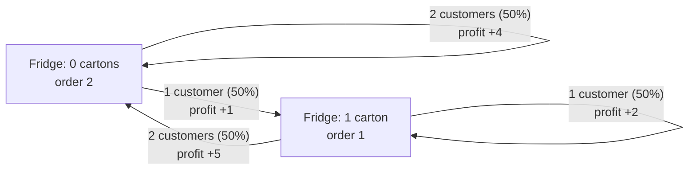

# 02 · States, Actions, Rewards and Policies

*Part 1 — The Problem · Based on Ch. 3.1–3.2 and 5.1–5.3 of* Reinforcement Learning: Foundations

---

## 1. Motivation: a plan breaks the first time luck interferes

In [post 01](01-what-is-reinforcement-learning.md) our coffee shop decided how much milk to order, and we kept talking about the owner's "strategy." Let's make that word precise, because it hides a real choice.

There are two very different things a strategy could be:

- **A plan:** *"Monday order 2 cartons, Tuesday order 2 cartons."* Everything is decided before the week starts.
- **A rule:** *"Each morning, look in the fridge. If it's empty, order 2. If there's 1 carton left, order 1."*

On Monday evening, the plan and the rule know the same things. On Tuesday morning they don't: if Monday was slow, there's a leftover carton, and the plan still says "order 2" even though the fridge only holds 2. The rule looks at the fridge first.

In RL, that kind of rule is called a **policy**, and nearly every algorithm in this series is a way of finding a good one. To define a policy, though, we first need to say exactly what "the situation" is. That's the job of the **model**.

---

## 2. The core idea without math

A sequential decision problem is described by four ingredients, plus one thing we choose:

| Ingredient | Question it answers | Coffee shop |
|---|---|---|
| **State** | What's the situation right now? | Cartons left in the fridge this morning |
| **Action** | What can I do? | How many cartons to order (only as many as fit) |
| **Transition** | What happens next? | Customers show up, buy milk, leftovers stay in the fridge |
| **Reward** | How good was that step? | Today's profit |
| **Policy** *(our choice)* | Given the situation, what do I do? | "Fill the fridge up to 2" |

The first four describe the **world**. The book calls this a *controlled dynamic system*. The policy describes the **agent**. Planning (Part 2 of this series) means finding the best policy when you know the first four. Learning (Part 3) means finding it when you don't.

### What makes a good state?

The book defines a state as **everything you need to predict what happens next**. That's a demanding definition, and choosing the state is one of the most important modelling decisions:

- If milk goes bad after two days, "number of cartons" is **not** enough. You also need to know how old each carton is.
- If more customers come on weekends, the state needs to include the **day of the week**.
- If you forgot what's hidden at the back of the fridge, you can't see the true state, and you're outside the standard model (this is called *partial observability*).

When the state contains everything relevant, the past stops mattering: what happens next depends only on **where you are now and what you do**. This is the **Markov property**, and it's what lets a policy look only at the current state.

---

## 3. Mathematical formulation

Time moves in steps $t = 0, 1, \dots, T-1$. At each step:

**Actions available in a state.** Not every action is allowed everywhere:

$$
a_t \in A(s_t)
$$

**Transitions.** In a *deterministic* world, the next state is a fixed function of the current state and action:

$$
s_{t+1} = f(s_t, a_t)
$$

In a *stochastic* (random) world, the next state is drawn from a probability distribution:

$$
\Pr(s_{t+1} = s' \mid s_t = s,\ a_t = a) = p(s' \mid s, a)
$$

**Markov property.** The whole history adds nothing beyond the current state and action:

$$
\Pr(s_{t+1} = s' \mid s_t, a_t, s_{t-1}, a_{t-1}, \dots, s_0, a_0) = p(s' \mid s_t, a_t)
$$

**Rewards.** Each step pays $r(s_t, a_t)$.

**Policies.** A deterministic policy picks one action per state, and a stochastic policy gives a probability to each action:

$$
a_t = \pi(s_t) \qquad\text{or}\qquad \Pr(a_t = a \mid s_t = s) = \pi(a \mid s)
$$

**Value of a policy.** The expected return when you start in state $s$ and follow $\pi$ for $T$ steps:

$$
V^\pi(s) = \mathbb{E}^{\pi}\!\left[\sum_{t=0}^{T-1} r(s_t, a_t) \;\middle|\; s_0 = s\right]
$$

---

## 4. Understanding the equations

- **$A(s)$** is the menu of actions in state $s$. In our shop, with 1 carton already in a fridge that holds 2, you can order 0 or 1, not 2.
- **$p(s' \mid s, a)$** reads *"the probability of landing in $s'$ if I'm in $s$ and do $a$."* For every $s$ and $a$, these probabilities add up to 1: something has to happen.
- **The Markov equation** says that the left side, which conditions on *everything so far*, equals the right side, which conditions only on the *latest* state and action. That's why we can write $p(s' \mid s, a)$ without any history.
- **$\pi(s)$ vs $\pi(a \mid s)$:** the first is a lookup table ("state → action"). The second is a table of dice ("state → probabilities over actions"). A deterministic policy is just a stochastic one that always puts probability 1 on one action.
- **$V^\pi(s)$** is a single number that grades the policy $\pi$ from starting state $s$. The superscript $\pi$ on the expectation is a reminder that the randomness comes from **two** sources: the world's transitions, and the policy's own dice (if it has any).

---

## 5. Derivation: where the probabilities of a whole day-by-day story come from

A **trajectory** (or history) is one full story: $h = (s_0, a_0, s_1, a_1, \dots, s_T)$. How likely is a particular story? Build it one step at a time. Each step multiplies in two factors, *"the policy chose this action"* and *"the world then produced this next state"*:

$$
\Pr(h) \;=\; \Pr(s_0) \prod_{t=0}^{T-1} \underbrace{\pi(a_t \mid s_t)}_{\text{agent}}\ \underbrace{p(s_{t+1} \mid s_t, a_t)}_{\text{world}}
$$

This formula matters for two reasons:

1. **It separates what you control from what you don't.** Changing the policy changes only the $\pi$ factors, while the $p$ factors belong to the world.
2. **It turns $V^\pi$ into a (possibly huge) weighted average.** $V^\pi(s)$ is the sum, over all possible trajectories, of *probability × return*. Section 8 does this sum by hand.

---

## 6. Intuition: which kinds of policy do we really need?

The book sorts policies along two dimensions:

```text
                         looks at…
                   whole history      current state (+ time)     current state only
                ┌──────────────────┬──────────────────────────┬────────────────────┐
 deterministic  │ history-dependent│ Markov                   │ stationary         │
                ├──────────────────┼──────────────────────────┼────────────────────┤
 stochastic     │ history-dependent│ Markov                   │ stationary         │
 (rolls dice)   │ randomized       │ randomized               │ randomized         │
                └──────────────────┴──────────────────────────┴────────────────────┘
   most general ◄──────────────────────────────────────────────────► simplest
```

History-dependent policies can remember everything, and stochastic policies can roll dice, so you might expect the most general kind to perform best. The book proves (Theorems 3.1–3.2, Proposition 5.4) that, for the expected-return objectives we use:

1. **Memory doesn't help.** For any history-dependent policy, there's a Markov policy that visits every (state, action) pair with exactly the same probabilities at every time step, and therefore earns exactly the same expected return. If the state is truly Markov, the history carries no extra information about the future.
2. **Dice don't help.** A random choice between two actions earns the *average* of their values, and an average is never higher than the better of the two. So you can always replace the dice with "just pick the better action" and lose nothing.

The result is that **the best policy can always be found among deterministic Markov policies**, which are simple lookup tables `(time, state) → action`. When the problem runs forever with fixed rules, even the time index can be dropped (Part 2).

> **Why do stochastic policies show up later, then?** In *learning*, dice are useful for *exploring* (post 07), and in huge problems they make optimization smoother (post 12). They aren't needed to get the best expected return when you already know the model.

---

## 7. Visualization: a plan vs a policy

Here's the shop as a diagram, under the policy **"fill the fridge up to 2"**: $\pi(0) = 2$, $\pi(1) = 1$. Each arrow is one possible day, labelled with the demand, its probability and the profit.



A **plan** would be a single path through this diagram, chosen before seeing any customers. A **policy** covers *every* box, so it already has an answer for "what if the fridge has a leftover?" The book calls this the ability to reason about **counterfactuals**: what you would do in situations that didn't happen (yet).

---

## 8. Numerical example: the coffee shop over two days

**The model:**

| Piece | Value |
|---|---|
| State $s$ | cartons in the fridge in the morning: 0 or 1 |
| Action $a$ | cartons to order; the fridge holds 2, so $A(0) = \{0,1,2\}$ and $A(1) = \{0,1\}$ |
| Demand $d$ | 1 or 2 customers, 50% each |
| Reward | $r = 3 \cdot \text{sold} - 1 \cdot a$, where $\text{sold} = \min(s + a,\ d)$ |
| Next state | $s' = s + a - \text{sold}$ (leftovers keep) |
| Horizon | $T = 2$ days, starting with an empty fridge |

### Step 1: list every trajectory under "fill the fridge"

Each day has two possible demands, so two days give $2 \times 2 = 4$ stories, each with probability $0.5 \times 0.5 = 0.25$:

| Day 1 | Day 2 | Probability | Return |
|---|---|---:|---:|
| $s=0$, order 2, 1 customer: $3 - 2 = +1$ | $s=1$, order 1, 1 customer: $3 - 1 = +2$ | 0.25 | **3** |
| $s=0$, order 2, 1 customer: $+1$ | $s=1$, order 1, 2 customers: $6 - 1 = +5$ | 0.25 | **6** |
| $s=0$, order 2, 2 customers: $6 - 2 = +4$ | $s=0$, order 2, 1 customer: $+1$ | 0.25 | **5** |
| $s=0$, order 2, 2 customers: $+4$ | $s=0$, order 2, 2 customers: $+4$ | 0.25 | **8** |

### Step 2: weighted average

$$
V^{\text{fill}}(0) = 0.25 \cdot 3 + 0.25 \cdot 6 + 0.25 \cdot 5 + 0.25 \cdot 8 = 5.50
$$

### Step 3: compare with fixed plans

A plan picks both days' orders in advance. Checking all of them:

| Plan (day 1, day 2) | Expected return |
|---|---:|
| (1, 1) | 4.00 |
| (1, 2) | 4.50 |
| (2, 0) | 4.00 |
| **(2, 1)** | **5.25** (best plan) |
| (2, 2) | not allowed: after a slow day, 1 + 2 cartons don't fit |

(Plans starting with 0 do worse still.)

The best plan, (2, 1), earns 5.25, while the policy earns **5.50**. Where does the difference come from? When day 1 is busy the fridge ends up empty, and the plan still orders only 1 carton on day 2, when 2 would have been better. The policy sees the empty fridge and orders 2.

### Step 4: does rolling dice help?

On a single day with an empty fridge, ordering 1 carton earns 2.00 on average and ordering 2 earns 2.50. A policy that flips a coin between them earns

$$
0.5 \cdot 2.00 + 0.5 \cdot 2.50 = 2.25 \;\le\; 2.50
$$

That's the average, and never better than just picking 2, exactly as Section 6 promised.

---

## 9. Practical implementation

The full script is [`code/02_coffee_shop_mdp.py`](code/02_coffee_shop_mdp.py). The core is small: a `step` function for the world, and a loop that expands every trajectory while multiplying the $\pi$ and $p$ factors from Section 5.

```python
PRICE, COST, CAPACITY = 3, 1, 2
DEMAND = {1: 0.5, 2: 0.5}

def step(s, a, d):
    stock = s + a
    sold = min(stock, d)
    return PRICE * sold - COST * a, stock - sold     # (reward, next state)

def value(policy, s0=0, horizon=2):
    paths = [(1.0, 0, s0)]                           # (probability, return so far, state)
    for t in range(horizon):
        new = []
        for prob, ret, s in paths:
            for a, pa in policy(t, s).items():       # agent: pi(a | s)
                for d, pd in DEMAND.items():         # world: p(s' | s, a)
                    r, s_next = step(s, a, d)
                    new.append((prob * pa * pd, ret + r, s_next))
        paths = new
    return sum(p * g for p, g, _ in paths)

fill = lambda t, s: {CAPACITY - s: 1.0}
print(value(fill))                                   # 5.5
```

The script also brute-forces all 36 policies that are allowed to change from day to day. None beats 5.50, and a 100,000-run simulation agrees (5.499).

### Why brute force stops working

We could check all 36 policies here because the problem is tiny. The book counts what happens with $n$ states, $m$ actions per state and $T$ steps:

$$
\#\text{paths from one start} = m^{T}, \qquad \#\text{Markov policies} = m^{\,nT}
$$

With just $n = m = T = 10$, that's $10^{10}$ paths and $10^{100}$ policies, more than the number of atoms in the observable universe (about $10^{80}$). Listing them is hopeless, so we need something smarter.

---

## 10. Assumptions and limitations

- **The state must really be Markov.** If important information is missing from the state (the age of the milk, the day of the week), a policy that looks only at the state can be fooled. The fix is usually to put that information *into* the state, which makes the state space larger.
- **"Memory and dice don't help" holds for expected return with a fully observed state.** With partial observability, adversaries, or risk-sensitive goals, history and randomness can matter.
- **Rewards and transitions here are known.** Everything in this post is planning. Parts 3–4 remove that assumption.
- **Finite horizons can make the best action depend on time.** On the last day before the shop closes for a holiday, restocking makes less sense. That's why a Markov policy is allowed to look at $t$ as well as $s$.

---

## Key takeaways

1. A decision problem is a **model**: states, actions (with $A(s)$), transitions $p(s' \mid s, a)$ and rewards $r(s,a)$.
2. A good **state** contains everything needed to predict the future, which is the **Markov property**.
3. A **policy** is a rule from situations to actions. Unlike a fixed plan, it can react to what luck brings, and in our shop it earns 5.50 vs 5.25.
4. $V^\pi(s)$ grades a policy: the probability-weighted average of returns over all trajectories, where each trajectory's probability multiplies **agent** factors $\pi$ and **world** factors $p$.
5. For expected return, **deterministic Markov policies are enough**: memory and dice don't improve the best achievable value. But there are far too many of them to try one by one.

---

## Connection to the bigger picture

We ended with a problem: $10^{100}$ policies, and we want the best one. The key observation, due to Richard Bellman, is that you don't have to search over whole policies at all. **If you know the best thing to do from tomorrow onward, today's decision is a simple one-step comparison.** Solving the problem backwards from the last day, one day at a time, turns an astronomically large search into a few small ones.

**Next post (03): Dynamic Programming: Think Backwards.** We'll solve the coffee shop again in a few lines of arithmetic, and see that the same idea finds shortest routes on a map.

```text
01 What is RL? ──► [02 Policies] ──► 03 Dynamic programming ──► 04 Markov chains ──► 05 MDPs ──► …
                     you are here
```
