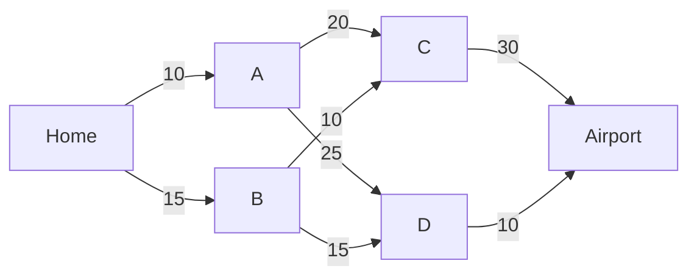

# 03 · Dynamic Programming: Think Backwards

*Part 2 — Planning · Based on Ch. 3.3–3.4 and Appendix A of* Reinforcement Learning: Foundations

---

## 1. Motivation: too many policies to try

[Post 02](02-states-actions-rewards-policies.md) ended with a problem. A policy is a lookup table from situations to actions, and even a small problem (10 states, 10 actions, 10 steps) has $10^{100}$ of them. Trying each one and keeping the best is hopeless.

This post introduces **dynamic programming** (DP), the idea that makes planning possible. Instead of searching over whole policies, it answers one small question at a time, **starting from the end**. For that same 10 × 10 × 10 problem, DP needs about $10^{3}$ calculations instead of $10^{100}$.

Almost every algorithm later in this series, including value iteration, Q-learning and DQN, is a variation on this idea. It's worth getting right.

---

## 2. The core idea without math

### The principle of optimality

Suppose the fastest drive from your home to the airport goes through town B. Then the part of that drive **from B to the airport** must also be the fastest way from B to the airport. If there were a faster way from B, you could swap it in and the whole trip would get faster, which contradicts "fastest."

Richard Bellman stated this in the 1950s as the **principle of optimality**:

> **Any piece of an optimal path is itself optimal between its end points.**

### Why this means "think backwards"

The principle suggests an order of work:

1. **Last step first.** One step before the airport, the answer is obvious: drive to the airport.
2. **Then the step before.** From a town two steps away, you already know how long the rest of the trip takes from each next town. So you only need to compare *"this road + the best time from where it leads."*
3. **Repeat backwards** until you reach home.

At every stage you **write down** the best time from each place (its *value*) so you never recompute it. Those two ingredients, *breaking a big problem into overlapping small ones* and *saving each answer*, are what "dynamic programming" means. (The name is historical: "programming" meant planning, as in a TV program schedule, not writing code.)

---

## 3. Mathematical formulation

A deterministic problem with horizon $T$ (from post 02): states $s_t$, actions $a_t \in A_t(s_t)$, transitions $s_{t+1} = f_t(s_t, a_t)$, rewards $r_t(s_t, a_t)$, and a **terminal reward** $r_T(s_T)$ for where you end up.

**Finite-horizon dynamic programming** (the book's Algorithm 1):

**Step 1: start at the end.**

$$
V_T(s) = r_T(s) \quad \text{for every state } s
$$

**Step 2: go backwards, for** $t = T-1, T-2, \dots, 0$:

$$
V_t(s) = \max_{a \in A_t(s)} \Big\{\, r_t(s, a) + V_{t+1}\big(f_t(s, a)\big) \Big\}
$$

**Step 3: read off the policy.**

$$
\pi^*_t(s) \in \arg\max_{a \in A_t(s)} \Big\{\, r_t(s, a) + V_{t+1}\big(f_t(s, a)\big) \Big\}
$$

The equation in Step 2 is **Bellman's equation**. When the next state is random, as in our coffee shop, we average over where we might land (the book's Remark 3.6, developed fully in Ch. 5):

$$
V_t(s) = \max_{a \in A_t(s)} \Big\{\, r_t(s, a) + \sum_{s'} p(s' \mid s, a)\, V_{t+1}(s') \Big\}
$$

---

## 4. Understanding the equations

- **$V_t(s)$ (the value function)** is *the best total reward you can still collect if you're in state $s$ at time $t$*. Think of it as a price tag on each situation.
- **$r_t(s,a)$** is what you get **now** for choosing $a$.
- **$V_{t+1}(f_t(s,a))$** is the best you can do **afterwards**, from wherever $a$ takes you. It was already computed on the previous backward pass, so it's just a lookup.
- **$\max_a$** means "try each action, keep the best." That's the only search DP does, and it's over *actions* (a handful), not *policies* (astronomically many).
- **$\arg\max$** returns *which* action achieved the max, and that choice is the policy.
- **$\sum_{s'} p(s' \mid s,a)\,V_{t+1}(s')$** in the random version is the *expected* value of tomorrow: each possible next state's value, weighted by how likely it is.

**Cost.** With $n$ states, $m$ actions and $T$ steps, DP does one comparison per (time, state, action):

$$
\underbrace{m \cdot n \cdot T}_{\text{dynamic programming}} \quad\text{vs}\quad \underbrace{m^{\,n T}}_{\text{try every policy}}
\qquad\Longrightarrow\qquad 10^3 \text{ vs } 10^{100} \text{ when } n=m=T=10
$$

---

## 5. Derivation: why backwards works

The book proves DP correct by **backward induction**. Stripped to its core:

1. **At time $T$** there are no decisions left, so $V_T(s) = r_T(s)$ is trivially the best you can do.
2. **Suppose $V_{t+1}$ is correct**, meaning it really is the best possible total from every state at time $t+1$.
3. **At time $t$**, any plan from state $s$ consists of *a first action* $a$ followed by *some continuation* from $f_t(s,a)$. The continuation can't beat $V_{t+1}(f_t(s,a))$ (by step 2). So the best total from $s$ is the best first action plus the best continuation, which is exactly Bellman's equation.
4. By induction, $V_0$ is correct, and so is the policy built from the $\arg\max$.

**Why not forwards?** For a deterministic problem you could also run DP forward from the start (Remark 3.8). With randomness you can't: the value of today's action depends on the *average* over tomorrow's possible states, and that average needs tomorrow's values to already exist. Working backwards guarantees they do.

---

## 6. Intuition: a value function is a map of "how good is it to be here?"

Once DP is done, you don't need to remember any plan. At any moment, you look at your options and ask: *"which action leads somewhere with the best reward-now plus value-later?"*

Road signs work the same way. A sign saying *"Airport 25 min"* is a value function: it summarizes the whole rest of the journey in one number, so a driver at a junction just compares signs. Nobody memorizes turn-by-turn directions for every possible starting point.

This idea carries through the rest of the series:

```text
post 03   V_t(s) by DP, model known, few states        (this post)
post 06   V(s) for problems that never end              (discounting, value iteration)
post 09   V(s) estimated from experience                (no model)
post 11   V(s) approximated by a neural network          (too many states to list)
```

---

## 7. Visualization: the drive to the airport

Minutes on each road. You leave home and must reach the airport in three legs:



Here we're **minimizing time** rather than maximizing reward. It's the same equation with $\min$ in place of $\max$ (a cost is just a negative reward).

**Filling in values from right to left:**

| Step | Town | Options: road + value of where it leads | Value | Best move |
|---:|---|---|---:|---|
| 1 | Airport | (arrived) | **0** | — |
| 2 | C | 30 + 0 | **30** | → Airport |
| 2 | D | 10 + 0 | **10** | → Airport |
| 3 | A | 20 + 30 = 50, 25 + 10 = **35** | **35** | → D |
| 3 | B | 10 + 30 = 40, 15 + 10 = **25** | **25** | → D |
| 4 | Home | 10 + 35 = 45, 15 + 25 = **40** | **40** | → B |

The best route is **Home → B → D → Airport, 40 minutes**. Following the "Best move" column forward from Home traces it out.

Two things to notice:

- **Greedy fails.** Always taking the shortest next road gives Home → A (10) → C (20) → Airport (30) = **60 minutes**. The cheap first road leads somewhere bad, and only the value column reveals that.
- **The principle of optimality in action.** The best route passes through B, and its remaining part B → D → Airport takes 25 minutes, exactly $V(B)$.

---

## 8. Numerical example: the coffee shop, solved backwards

Same model as post 02: fridge holds 2, each carton costs \$1 and sells for \$3, demand is 1 or 2 customers (50% each), leftovers keep, and they're worth nothing after the last day, so $V_2(s) = 0$.

Each cell below is *expected profit today + expected value of tomorrow's fridge*.

**Day 2 (the last day).** Tomorrow is worth nothing, so this is just one day's expected profit:

| Fridge | Order 0 | Order 1 | Order 2 | $V_1(s)$ | Best |
|---:|---:|---:|---:|---:|---|
| 0 | 0.00 | 2.00 | **2.50** | **2.50** | order 2 |
| 1 | 3.00 | **3.50** | — (doesn't fit) | **3.50** | order 1 |

**Day 1.** Now add the value of the fridge we'll wake up to. For example, with an empty fridge and "order 2":

$$
\underbrace{0.5\,(3-2) + 0.5\,(6-2)}_{\text{today: } 2.50} \;+\; \underbrace{0.5\cdot V_1(1) + 0.5\cdot V_1(0)}_{\text{tomorrow: } 0.5\cdot 3.50 + 0.5\cdot 2.50 \;=\; 3.00} \;=\; 5.50
$$

| Fridge | Order 0 | Order 1 | Order 2 | $V_0(s)$ | Best |
|---:|---:|---:|---:|---:|---|
| 0 | 2.50 | 4.50 | **5.50** | **5.50** | order 2 |
| 1 | 5.50 | **6.50** | — | **6.50** | order 1 |

The answer is **5.50** with the policy "fill the fridge," the same result post 02 found by checking all 36 policies. DP needed just **10** one-step comparisons.

**Scaling up.** Over a **30-day** season, DP needs 150 comparisons, compared with $6^{30} \approx 2.2 \times 10^{23}$ policies. It gives $V_0(0) = 89.50$, and the best rule turns out to be "fill the fridge" on every single day. In this shop the last day isn't special, but DP would have noticed if it were.

---

## 9. Shortest paths: the same idea on a map

When a trip ends at a *goal* rather than after a fixed number of steps, DP becomes the **shortest path problem**. Let $d(u)$ be the shortest travel time from $u$ to the destination. Bellman's equation reads:

$$
d(u) = \min_{u' \,:\, (u, u') \text{ is a road}} \big\{\, c(u, u') + d(u') \,\big\}
$$

*"The shortest trip from $u$ = best choice of first road + shortest trip from where it leads."* The book covers three classic algorithms built on this equation.

### Bellman–Ford: DP with a growing horizon

Start with $d = 0$ at the destination and $\infty$ everywhere else, then apply the equation to every node, round after round. After round $i$, $d(u)$ is the shortest trip **using at most $i$ roads**, which is exactly finite-horizon DP with horizon $i$.

On the airport graph:

| Round | Home | A | B | C | D |
|---:|---:|---:|---:|---:|---:|
| 1 | ∞ | ∞ | ∞ | 30 | 10 |
| 2 | ∞ | 35 | 25 | 30 | 10 |
| 3 | **40** | 35 | 25 | 30 | 10 |
| 4 | 40 | 35 | 25 | 30 | 10 ← nothing changed, stop |

It handles negative road costs too, and because each node only needs its neighbours' current values, it runs well in distributed systems like internet routing.

### Dijkstra: settle the closest places first

If all costs are non-negative, you can be smarter: **finalize nodes in order of distance**. The closest node's distance can never improve later, so fix it, update its neighbours, and repeat. Each road is examined once instead of once per round.

### A\*: aim at the goal

Dijkstra explores in all directions evenly. If you have a **heuristic** $h(u)$, an estimate of the remaining distance, A\* explores nodes in order of

$$
\underbrace{d(u)}_{\text{distance so far}} + \underbrace{h(u)}_{\text{guess of distance left}}
$$

so it heads toward the goal first. It is still guaranteed to find the shortest path as long as $h$ **never overestimates** (the book's *admissible* and *consistent* heuristics). The straight-line distance on a map is the classic example. The book notes this kind of **optimism** comes back later in learning algorithms.

**On a 20 × 12 grid with a wall** (moves cost 1, heuristic = grid distance ignoring the wall), both find the same 27-step path, but Dijkstra expands **214** cells while A\* expands only **141**.

---

## 10. Practical implementation

The full script is [`code/03_dynamic_programming.py`](code/03_dynamic_programming.py). It checks every number in this post. The core DP for the coffee shop fits in a few lines:

```python
PRICE, COST, CAPACITY = 3, 1, 2
DEMAND = {1: 0.5, 2: 0.5}
STATES = [0, 1]

def outcomes(s, a):
    for d, p in DEMAND.items():
        sold = min(s + a, d)
        yield p, PRICE * sold - COST * a, s + a - sold     # (prob, reward, next state)

def solve(horizon):
    V = {s: 0.0 for s in STATES}                            # V_T = 0
    policy = []
    for t in reversed(range(horizon)):                      # backwards!
        Q = {s: {a: sum(p * (r + V[s2]) for p, r, s2 in outcomes(s, a))
                 for a in range(CAPACITY - s + 1)}
             for s in STATES}
        V = {s: max(Q[s].values()) for s in STATES}          # Bellman's equation
        policy.insert(0, {s: max(Q[s], key=Q[s].get) for s in STATES})
    return V, policy

V, policy = solve(2)
print(V[0], policy)    # 5.5  [{0: 2, 1: 1}, {0: 2, 1: 1}]
```

The inner dictionary `Q[s][a]`, *"value of doing $a$ in $s$, then acting optimally,"* gets its own name in post 05: the **Q function**. It's the Q in Q-learning.

### DP outside of decision making

Appendix A of the book shows that DP is a general problem-solving trick, not only a planning tool:

- **Fibonacci numbers.** The naive recursion for $F_{30}$ makes **2,692,537** function calls, because it recomputes the same values over and over. Saving each answer and building upwards takes **30** additions.
- **Largest sum of a contiguous stretch** in $(2, -5, 3, 1, -2, 4, -6, 1)$. Let $V_t$ be the best sum *ending exactly at position $t$*. Then $V_t = \max(V_{t-1} + x_t,\ x_t)$: either extend the previous stretch or start fresh. That gives $V = (2, -3, 3, 4, 2, 6, 0, 1)$, and the answer is **6** (from $3 + 1 - 2 + 4$). This takes one pass instead of checking every start and end.

In both cases the hard part is choosing **what $V$ should mean**. Once that's right, the recursion almost writes itself.

---

## 11. Assumptions and limitations

- **You need the model.** DP uses $f$ (or $p$) and $r$ directly. When the model is unknown, you need learning (Part 3).
- **You need to list every state.** DP visits each state at each step. That's fine for 2 fridge levels, but hopeless for a chess board or a camera image. This is the *curse of dimensionality*, and it motivates Part 4.
- **Backwards needs a known ending.** Finite-horizon DP assumes you know when the problem stops. Problems that go on indefinitely need discounting (post 06).
- **Shortest-path fine print.** Dijkstra and A\* need non-negative costs. Bellman–Ford allows negative costs but not *negative cycles* (loops you could drive around forever to "earn" time), and it can detect them.
- **Skipped for now:** the book's Ch. 3 also covers the *average-cost* criterion and continuous control (*LQR*). They're important in control engineering but not needed for the rest of this series.

---

## Key takeaways

1. **Principle of optimality:** every piece of an optimal path is optimal, so big decisions can be built from small ones.
2. **Dynamic programming** solves the last step first and works backwards with **Bellman's equation**: $V_t(s) = \max_a \{ r_t(s,a) + V_{t+1}(\text{next state}) \}$.
3. The **value function** $V_t(s)$ is a price tag on each situation. With it, acting optimally is a one-step lookahead.
4. The cost drops from $m^{nT}$ policies to $m \cdot n \cdot T$ comparisons: $10^{100} \to 10^3$.
5. **Bellman–Ford, Dijkstra and A\*** are the same idea applied to reaching a goal, with A\* adding an optimistic guess to search faster.

---

## Connection to the bigger picture

So far, randomness has been a small add-on: we averaged over tomorrow's demand in one line. Before building the full theory of decision-making under uncertainty, we need to understand what happens when a random process runs for a long time. Where does it tend to spend its time? Does it settle down?

**Next post (04): Adding Dice: Markov Chains.** It covers the math of random processes without decisions, which is the foundation of the MDPs in post 05.

```text
01 What is RL? ──► 02 Policies ──► [03 Dynamic programming] ──► 04 Markov chains ──► 05 MDPs ──► …
                                      you are here
```
