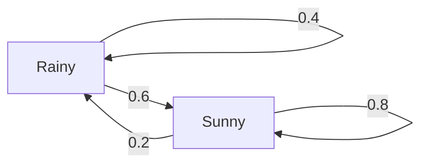

# 04 · Adding Dice: Markov Chains

*Part 2 — Planning · Based on Ch. 4 of* Reinforcement Learning: Foundations

---

**How to read this post.** Sections 1–4 are the working knowledge: what a Markov chain is and what the stationary distribution means. Sections 5–8 are the theory in full, with the book's proofs written out. Sections 9–11 come back to the coffee shop. If you only want the intuition, read 1–4, then jump to 9.

---

## 1. Motivation: what happens if you just let it run?

Posts 02 and 03 treated randomness as a detail: when demand was uncertain, we averaged over it and moved on. But there's a question we skipped, and it matters as soon as a problem runs for more than a few steps:

> **If I keep following the same policy forever, what does my life look like on average?**

For the coffee shop: what fraction of mornings do I wake up to an empty fridge? How many days pass between two empty mornings? What's my average profit per day?

These questions have nothing to do with choosing actions. Once you **fix** a policy, the decisions disappear and what remains is a random process wandering between states. That process is a **Markov chain**, and this post is about what it does in the long run.

This is the last piece of background before MDPs (post 05). It's worth the detour because "average reward per step" appears everywhere in RL, and it's exactly what a Markov chain's long-run behaviour tells you.

---

## 2. The core idea without math

A Markov chain is the world from post 02 with the actions removed: a set of states, and a fixed probability for moving from each state to each other state.

The defining feature is the **Markov property** again: where you go next depends only on where you are now, not on how you got there.

Here's a weather model. Tomorrow's weather depends on today's:



Three questions we want answered:

1. **Where will I be in $t$ steps?** If it's rainy today, what's the chance of rain on Friday?
2. **Where do I end up in the long run?** After many steps, does the answer stop depending on today's weather?
3. **How often do I return?** On average, how many days pass between rainy days?

The remarkable fact is that for most chains, the answer to question 2 is *"the starting point stops mattering entirely."* The chain forgets where it came from and settles into a fixed proportion of time spent in each state, called the **stationary distribution**.

---

## 3. Mathematical formulation

A Markov chain is a sequence of random states $X_0, X_1, X_2, \dots$ taking values in a finite or countable state space $\mathcal{X}$, satisfying

$$
\Pr(X_{t+1} = j \mid X_t = i, X_{t-1}, \dots, X_0) = \Pr(X_{t+1} = j \mid X_t = i)
$$

We assume the chain is **time-homogeneous**: this probability doesn't depend on $t$, so we can name it

$$
p_{i,j} \;=\; \Pr(X_{t+1} = j \mid X_t = i)
$$

**The transition matrix** $P$ collects all the $p_{i,j}$, one row per current state. It is *row-stochastic*:

$$
P = \begin{bmatrix} 0.4 & 0.6 \\ 0.2 & 0.8 \end{bmatrix}
\qquad
p_{i,j} \ge 0, \qquad \sum_j p_{i,j} = 1 \ \text{ for every row } i
$$

**The probability of a whole trajectory** factorizes, exactly as in post 02 but without the policy factors:

$$
\Pr(X_0 = i_0, X_1 = i_1, \dots, X_t = i_t) = p_0(i_0)\, p_{i_0,i_1} \, p_{i_1,i_2} \cdots p_{i_{t-1},i_t}
$$

**Where you are after $t$ steps.** Write your current belief as a row vector $p_t$. One step is a multiplication, so $t$ steps is a matrix power:

$$
p_{t+1} = p_t P \qquad\Longrightarrow\qquad p_t = p_0 P^{\,t},
\qquad\text{and}\qquad p^{(m)}_{i,j} := \Pr(X_m = j \mid X_0 = i) = [P^{\,m}]_{i,j}
$$

**The stationary (invariant) distribution** $\mu$ is a distribution that doesn't change when you take a step:

$$
\mu = \mu P
\qquad\text{that is}\qquad
\mu_j = \sum_i \mu_i\, p_{i,j} \quad \text{for every } j
$$

**Return time.** Let $T_i = \inf\{t \ge 1 : X_t = i\}$ be the first return time to $i$, starting from $i$. For a nice chain,

$$
\mathbb{E}[T_i] = \frac{1}{\mu_i}
$$

**Long-run average of anything.** If each visit to state $i$ pays $f(i)$:

$$
\lim_{t \to \infty} \frac{1}{t}\sum_{s=0}^{t-1} f(X_s) = \sum_i \mu_i f(i)
$$

This last one is the **ergodic theorem**, and it's the formula behind "average reward per step."

---

## 4. Understanding the equations

- **A row of $P$** is a complete forecast from one state: *"if it's rainy today, tomorrow is 40% rainy and 60% sunny."* Rows sum to 1; columns generally don't.
- **$p_t = p_0 P^t$:** each multiplication pushes your uncertainty forward one day. The matrix product sums over all the ways to get there: $p^{(m+n)}_{i,j} = \sum_k p^{(m)}_{i,k}p^{(n)}_{k,j}$ (the *Chapman–Kolmogorov* identity, which is just "pass through some middle state $k$").
- **$\mu = \mu P$** says $\mu$ is a *fixed point*: feed it in, get it back. Compare with Bellman's equation from post 03, also a fixed point. This pattern runs through the whole field.
- **$\mathbb{E}[T_i] = 1/\mu_i$** is the most intuitive formula here. If you're in a state a quarter of the time, you visit it once every 4 steps on average.
- **The ergodic theorem** says a *time average* (one long run) equals a *state average* (weighted by $\mu$). Watch one shop for a year, or weight each fridge level by how often it occurs: same answer.

---

## Part II — the theory in detail

Everything above rests on one question: **when does a chain have a stationary distribution, and when does it converge to it?** The answer needs two structural properties (Section 5), a notion of which states come back (Section 6), and then an existence-and-uniqueness theorem (Section 7).

---

## 5. State classification

### 5.1 Accessibility and communicating classes

> **Definition (accessible).** State $j$ is **accessible** from $i$, written $i \to j$, if $p^{(m)}_{i,j} > 0$ for some $m \ge 1$.

There's a picture that makes this concrete. Draw a directed graph with one node per state and an edge $i \to j$ whenever $p_{i,j} > 0$. Then $j$ is accessible from $i$ **iff there is a directed path from $i$ to $j$**. (Probabilities along a path multiply, and a product of positive numbers is positive.)

Accessibility is **transitive**: if $i \to j$ and $j \to k$ then $i \to k$. Indeed, pick $m_1$ with $p^{(m_1)}_{i,j} > 0$ and $m_2$ with $p^{(m_2)}_{j,k} > 0$; then

$$
p^{(m_1+m_2)}_{i,k} \;\ge\; p^{(m_1)}_{i,j}\, p^{(m_2)}_{j,k} \;>\; 0
$$

(going via $j$ is *one* of the ways to get from $i$ to $k$, so it's a lower bound.)

> **Definition (communicate, class).** States $i$ and $j$ **communicate** if $i \to j$ and $j \to i$. A **communicating class** is a maximal set of states that all communicate with each other — a strongly connected component of the graph.
>
> **Definition (irreducible).** The chain is **irreducible** if all states form a single class: the graph is strongly connected.

A class is **closed** if no transition leaves it. Closed classes are where the chain eventually lives; the rest of the chain drains into them.

**Example (checked in the code).** Take

$$
P = \begin{bmatrix}
0.5 & 0.4 & 0.1 & 0 \\
0.5 & 0.5 & 0 & 0 \\
0 & 0 & 0.3 & 0.7 \\
0 & 0 & 0.6 & 0.4
\end{bmatrix}
$$

The classes are $\{0,1\}$ and $\{2,3\}$. From state 0 there's a 10% chance of slipping into state 2, and once there you can never come back, so $\{0,1\}$ is **not** closed. Simulating 200,000 steps, the fraction of time spent in states 0 and 1 rounds to 0.0000: the chain leaves early and never returns.

### 5.2 Period

> **Definition (period).** The period of state $i$ is
> $$d_i = \gcd\{m \ge 1 : p^{(m)}_{i,i} > 0\}$$
> State $i$ is **aperiodic** if $d_i = 1$.

The period is the rhythm of the state: every loop from $i$ back to $i$ has length divisible by $d_i$. A chain that swaps between two states has period 2; a 3-cycle has period 3; a state with a self-loop ($p_{i,i} > 0$) has period 1 immediately, since 1 is in the set.

> **Claim 4.1.** Two states in the same communicating class have the same period.

**Proof.** Let $i, j$ be in the same class with periods $d_i, d_j$. Because they communicate, there are lengths $m_{i,j}$ and $m_{j,i}$ with $p^{(m_{i,j})}_{i,j} > 0$ and $p^{(m_{j,i})}_{j,i} > 0$. Going $i \to j \to i$ is a loop at $i$, so $d_i$ divides $m_{i,j} + m_{j,i}$.

Suppose, for contradiction, that $d_i$ does **not** divide $d_j$. Then there's a loop at $j$ of some length $m_{j,j}$ that $d_i$ does not divide. (If $d_i$ divided every loop length at $j$, it would divide their gcd, which is $d_j$.) Now build a longer loop at $i$:

$$
i \;\xrightarrow{\;m_{i,j}\;}\; j \;\xrightarrow{\;m_{j,j}\;}\; j \;\xrightarrow{\;m_{j,i}\;}\; i
$$

Its length is $m_{i,j} + m_{j,j} + m_{j,i}$, which must be divisible by $d_i$. But we already know $d_i$ divides $m_{i,j} + m_{j,i}$, so $d_i$ must divide $m_{j,j}$ — contradicting how we chose it. Hence $d_i \mid d_j$, and by the symmetric argument $d_j \mid d_i$, so $d_i = d_j$. $\blacksquare$

So "irreducible" and "aperiodic" are properties of the **chain**, not of individual states — which is why the main theorem can state them so briefly.

---

## 6. Recurrence: which states come back?

### 6.1 Recurrent and transient

> **Definition.** State $i$ is **recurrent** if $\Pr(X_t = i \text{ for some } t \ge 1 \mid X_0 = i) = 1$. Otherwise it is **transient**.

Write $q_i$ for that return probability. Transient means $q_i < 1$: there's a positive chance you leave and never come back.

> **Claim 4.2.** State $i$ is transient $\iff$ $\displaystyle\sum_{m=1}^{\infty} p^{(m)}_{i,i} < \infty$.

**The idea.** That sum is the *expected number of returns to $i$*, and a process that returns with probability $q < 1$ each time makes a geometric number of returns.

**Proof.** Let $Z_i$ be the total number of times the chain returns to $i$. Writing $Z_i$ as a sum of indicators and using linearity of expectation,

$$
\mathbb{E}[Z_i] = \mathbb{E}\Big[\sum_{m \ge 1} \mathbb{I}[X_m = i]\Big] = \sum_{m\ge 1} \Pr(X_m = i \mid X_0 = i) = \sum_{m \ge 1} p^{(m)}_{i,i}
$$

Now use the Markov property: each time the chain is at $i$, it returns at least once more with probability exactly $q_i$, independently of the past. So $Z_i$ is geometric: $\Pr(Z_i = k) = q_i^{\,k}(1 - q_i)$, and

$$
\mathbb{E}[Z_i] = (1-q_i)\sum_{k \ge 0} k\, q_i^{\,k} = (1-q_i)\frac{q_i}{(1-q_i)^2} = \frac{q_i}{1-q_i}
$$

If $i$ is transient ($q_i < 1$), this is finite, so the sum converges. If $i$ is recurrent ($q_i = 1$), the chain returns infinitely often with probability 1, so $\mathbb{E}[Z_i] = \infty$ and the sum diverges. The two cases are exhaustive, so the equivalence holds in both directions. $\blacksquare$

> **Claim 4.3.** Recurrence is a class property: if $i$ is recurrent and $i \leftrightarrow j$, then $j$ is recurrent.

**Proof.** Because they communicate, pick $k$ with $p^{(k)}_{i,j} > 0$ and $k'$ with $p^{(k')}_{j,i} > 0$. One way to loop from $j$ back to $j$ in $k' + m + k$ steps is: go $j \to i$ in $k'$ steps, loop at $i$ for $m$ steps, then go $i \to j$ in $k$ steps. Since that's only one of the possibilities,

$$
p^{(k'+m+k)}_{j,j} \;\ge\; p^{(k')}_{j,i}\; p^{(m)}_{i,i}\; p^{(k)}_{i,j}
$$

Summing over $m$:

$$
\sum_{m} p^{(m)}_{j,j} \;\ge\; p^{(k')}_{j,i}\, p^{(k)}_{i,j} \sum_{m} p^{(m)}_{i,i} \;=\; \infty
$$

because the last sum diverges ($i$ is recurrent, by Claim 4.2) and the two prefactors are strictly positive. So $j$ is recurrent too. $\blacksquare$

### 6.2 How long until it comes back?

> **Definition (return time).** $T_i = \inf\{t \ge 1 : X_t = i\}$, starting from $X_0 = i$.
>
> **Claim 4.5.** If $i$ is recurrent then $T_i < \infty$ with probability 1.

That's just a restatement of the definition: the chain does return, so the waiting time is finite. But **finite with probability 1 is not the same as having a finite average**. A classic example: a random time $T$ with $\Pr[T = 2^k] = 2^{-k}$ is finite always, yet

$$
\mathbb{E}[T] = \sum_k 2^k \cdot 2^{-k} = \sum_k 1 = \infty
$$

This distinction gets its own names:

> **Definition.** A recurrent state is **positive recurrent** if $\mathbb{E}[T_i] < \infty$, and **null recurrent** if $\mathbb{E}[T_i] = \infty$.

> **Claim 4.6.** In a finite state space, every recurrent state is positive recurrent. (Null recurrence needs infinitely many states.)

**Proof.** Work inside a closed class $C$ of size $n$ containing $i$ (a recurrent state's class is closed: any escape route would be a path with no way back, contradicting recurrence). Since the class communicates, from **every** state $s \in C$ there is a path to $i$ of length at most $n$, whose probability is some $\varepsilon_s > 0$. Let $\varepsilon = \min_{s \in C}\varepsilon_s > 0$ — a minimum over finitely many positive numbers, so it's positive.

Now chop time into blocks of $n$ steps. In each block, wherever the chain happens to be at the start, it hits $i$ during that block with probability at least $\varepsilon$. So the number of blocks needed is dominated by a geometric random variable with success probability $\varepsilon$, and

$$
\mathbb{E}[T_i] \;\le\; n \cdot \frac{1}{\varepsilon} \;<\; \infty \qquad\blacksquare
$$

The finiteness of $\mathcal{X}$ was used twice: to get a uniform path length $n$, and to take a positive minimum $\varepsilon$. With infinitely many states, both can fail.

### 6.3 Two examples on the integers

**Example A — the fair random walk is null recurrent.** States are all integers; from $i$ you go to $i+1$ or $i-1$ with probability $\tfrac12$ each.

*It is recurrent.* To be back at 0 after $2k$ steps you need exactly $k$ steps up and $k$ down:

$$
p^{(2k)}_{0,0} = \binom{2k}{k} 2^{-2k} \;\approx\; \frac{1}{\sqrt{\pi k}}
$$

(by Stirling's approximation). Since $\sum_k 1/\sqrt{k}$ diverges, so does $\sum_m p^{(m)}_{0,0}$, and Claim 4.2 says state 0 is recurrent. The numbers:

| $k$ | $p^{(2k)}_{0,0}$ | $1/\sqrt{\pi k}$ | running sum |
|---:|---:|---:|---:|
| 1 | 0.5000 | 0.5642 | 0.500 |
| 2 | 0.3750 | 0.3989 | 0.875 |
| 4 | 0.2734 | 0.2821 | 1.461 |
| 8 | 0.1964 | 0.1995 | 2.338 |

*But the expected return time is infinite.* Let $Z_{i,j}$ be the time to walk from $i$ to $j$. Conditioning on the first step and using symmetry ($\mathbb{E}[Z_{i+1,i}] = \mathbb{E}[Z_{i-1,i}] = \mathbb{E}[Z_{1,0}]$):

$$
\mathbb{E}[T_i] = 1 + \tfrac12 \mathbb{E}[Z_{i+1,i}] + \tfrac12 \mathbb{E}[Z_{i-1,i}] = 1 + \mathbb{E}[Z_{1,0}]
$$

Now condition on the first **two** steps instead. With probability $\tfrac12$ you're back at $i$ (cost 2), and otherwise you're at $i\pm2$. To get from $i+2$ to $i$ you must pass through $i+1$, so $Z_{i+2,i} = Z_{i+2,i+1} + Z_{i+1,i}$, and each piece has mean $\mathbb{E}[Z_{1,0}]$:

$$
\mathbb{E}[T_i] = 2 + \tfrac14\mathbb{E}[Z_{i+2,i}] + \tfrac14\mathbb{E}[Z_{i-2,i}] = 2 + \mathbb{E}[Z_{1,0}]
$$

Both expressions are valid, so $1 + \mathbb{E}[Z_{1,0}] = 2 + \mathbb{E}[Z_{1,0}]$, which no finite number satisfies. Hence $\mathbb{E}[Z_{1,0}] = \infty$ and $\mathbb{E}[T_i] = \infty$: the walk is **null recurrent**. (It also has period 2: every return uses equally many up and down steps.)

Simulation shows this in a way that's hard to miss. Capping each run at $N$ steps and averaging what we see:

| Cap $N$ | Returned before the cap | Average (capped) return time |
|---:|---:|---:|
| 100 | 91.9% | 16.0 |
| 1,000 | 97.5% | 50.8 |
| 10,000 | 99.3% | 144.5 |
| 100,000 | 99.8% | 457.6 |

Almost every run returns, yet the average keeps growing as we allow longer runs. That's what an infinite mean looks like in practice.

**Example B — the walk with jumps is positive recurrent.** Same states, but from $i$ you go to $i+1$ with probability $\tfrac12$ and jump back to 0 with probability $\tfrac12$.

From anywhere you return to 0 with probability $\tfrac12$ per step, so $T_0$ is geometric and $\mathbb{E}[T_0] = 2$. For a general state $i$, split the wait into "get back to 0" (mean 2) plus "climb from 0 up to $i$". Each excursion from 0 reaches $i$ with probability $2^{-i}$ and lasts about 2 steps, giving the book's bound $\mathbb{E}[T_i] \le 2 + 2\cdot 2^i$.

The exact answer is $\mathbb{E}[T_i] = 2^{\,i+1}$, matching $\mu_i = 2^{-(i+1)}$ through $\mathbb{E}[T_i] = 1/\mu_i$. Simulation agrees: 2.00, 4.00 and 15.98 for $i = 0, 1, 3$. This chain is aperiodic (state 0 has a self-loop through the jump) and all states are positive recurrent.

> **Theorem 4.10 (countable chains).** For an irreducible chain on a countable state space, exactly one of these holds: all states are positive recurrent, all are null recurrent, or all are transient.

The proof is the same style as Claim 4.3: sandwich one state's return time (or return sum) between another's using the two connecting paths.

---

## 7. The invariant distribution

> **Definition.** A probability vector $\mu$ is **invariant** (equivalently *stationary*, or *steady state*) if
> $$\mu^\top P = \mu^\top, \qquad\text{i.e.}\qquad \mu_j = \sum_i \mu_i\,p_{i,j}\ \ \forall j$$

If $X_t \sim \mu$ then $X_{t+1} \sim \mu$: start the chain in $\mu$ and it stays there forever, which is why the process is then called *stationary*.

### 7.1 Existence and uniqueness

> **Theorem 4.7.** Let $(X_t)$ be an irreducible, aperiodic Markov chain on a **finite** state space, with transition matrix $P$. Then there is a **unique** distribution $\mu$ with $\mu^\top P = \mu^\top$, and $\mu_i > 0$ for every $i$.

**Proof.** Four steps.

**Step 1: no eigenvalue exceeds 1.** If $Px = \lambda x$ then, because each row of $P$ is a set of weights summing to 1, every entry of $Px$ is an average of entries of $x$, so $\|Px\|_\infty \le \|x\|_\infty$. Hence $|\lambda| \le 1$.

**Step 2: 1 is an eigenvalue, and it has a left eigenvector.** Rows sum to 1, which says exactly $P\mathbf{1} = \mathbf{1}$: the all-ones vector is a right eigenvector with eigenvalue 1, the largest possible by Step 1. A square matrix has the same left and right eigenvalues (they share a characteristic polynomial), so there exists $x \ne 0$ with $x^\top P = x^\top$.

**Step 3: that eigenvector can be taken non-negative.** Since the chain is irreducible and aperiodic and $\mathcal X$ is finite, there is an $m$ with $A := P^m$ **strictly positive** in every entry. (Irreducibility gives a path between any two states; aperiodicity means the available path lengths stop having a common divisor, so from some point on every long enough length works; finiteness lets us take a single $m$ that works for all pairs.) Note $x^\top A = x^\top$ too.

If $x$ has complex entries, its real and imaginary parts are each eigenvectors of eigenvalue 1, and one is non-zero, so we may take $x$ real. If $x \ge 0$ or $x \le 0$ we are done (flip the sign if needed). So suppose $x$ has **both** a strictly positive and a strictly negative entry. Then for each $j$, since all $A_{i,j} > 0$, the triangle inequality is *strict*:

$$
|x_j| = \Big|\sum_i x_i A_{i,j}\Big| \;<\; \sum_i |x_i| A_{i,j}
$$

Summing over $j$ and swapping the order of summation:

$$
\sum_j |x_j| \;<\; \sum_i |x_i| \sum_j A_{i,j} \;=\; \sum_i |x_i|
$$

using that $A$ is row-stochastic. That says a number is strictly less than itself — a contradiction. So $x$ cannot have mixed signs.

**Step 4: normalize, and get strict positivity.** Set $\mu = x / \|x\|_1 \ge 0$, a probability vector with $\mu^\top P = \mu^\top$. Then $\mu^\top = \mu^\top A$, and since $A > 0$ entrywise while $\mu \ne 0$, every entry $\mu_j = \sum_i \mu_i A_{i,j} > 0$.

**Uniqueness.** Suppose $x \ne y$ are two invariant distributions. By the above both are strictly positive. Choose a linear combination $z = ax + by$ that makes one coordinate vanish — for instance $a = y_k$, $b = -x_k$ for some index $k$ gives $z_k = 0$. But $z^\top P = z^\top$, so by the same argument $z$ is either strictly positive or strictly negative in **every** coordinate (or zero everywhere). Since $z_k = 0$, we must have $z \equiv 0$, i.e. $y_k x = x_k y$: the two vectors are proportional. Both sum to 1, so $x = y$. $\blacksquare$

### 7.2 What $\mu$ means: frequency of visits

Define the fraction of the first $m$ steps spent in state $j$:

$$
\pi^{(m)}_j = \frac{1}{m}\sum_{t=1}^{m} \mathbb{I}[X_t = j]
$$

> **Theorem 4.8.** For a finite irreducible aperiodic chain, for every $j$:
> $$\mu_j \;=\; \lim_{m\to\infty}\mathbb{E}\big[\pi^{(m)}_j\big] \;=\; \frac{1}{\mathbb{E}[T_j]}$$

**Proof, first equality.** Take expectations inside the sum:

$$
\mathbb{E}\big[\pi^{(m)}_j\big] = \frac{1}{m}\sum_{t=1}^m \Pr(X_t = j) = \frac{1}{m}\sum_{t=1}^m x_0^\top P^{\,t} e_j
$$

where $e_j$ is the indicator vector of $j$. By the limit law for Markov chains (part 3 of Theorem 4.9 below), $x_0^\top P^{\,t} \to \mu^\top$ for any start $x_0$. An average of a sequence converging to $\mu_j$ also converges to $\mu_j$, so the left side tends to $\mu_j$.

**Proof, second equality.** Look at the same quantity through the *gaps between visits*. Let $T_{k,j}$ be the time between the $k$-th and $(k{+}1)$-th visit to $j$. By the Markov property, the chain restarts fresh at each visit, so $T_{1,j}, T_{2,j}, \dots$ are i.i.d. copies of $T_j$. After $n$ visits, the elapsed time is $\sum_{k=1}^n T_{k,j}$, so

$$
\lim_{m \to \infty}\frac{1}{m}\sum_{t=1}^m \mathbb{I}[X_t = j] \;=\; \lim_{n\to\infty} \frac{n}{\sum_{k=1}^n T_{k,j}}
$$

By the law of large numbers $\frac1n\sum_{k\le n} T_{k,j} \to \mathbb{E}[T_j]$, hence the right-hand side tends to $1/\mathbb{E}[T_j]$. Comparing the two limits gives $\mu_j = 1/\mathbb{E}[T_j]$. $\blacksquare$

Two immediate consequences: $\mu_j > 0$ forces $\mathbb{E}[T_j] < \infty$ (finite irreducible aperiodic chains are positive recurrent), and the intuitive reading — *the share of time you spend somewhere is one over the gap between visits* — is exactly right.

### 7.3 The theorem that ties it together

> **Theorem 4.9.** Let $(X_t)$ be a finite, irreducible, aperiodic Markov chain. Then:
>
> 1. All states are positive recurrent.
> 2. There is a unique stationary distribution $\mu$, and $\mu_i = 1/\mathbb{E}[T_i]$.
> 3. **Convergence:** $\lim_{t\to\infty}\Pr(X_t = j) = \mu_j$ for every $j$, from any starting distribution.
> 4. **Ergodicity:** for any bounded $f$, $\ \lim_{t\to\infty}\frac1t\sum_{s=0}^{t-1} f(X_s) = \sum_i \mu_i f(i)$.

**Proof.** Parts 1 and 2 are Theorems 4.7 and 4.8.

For part 3, assume $P$ is diagonalizable (the general case uses Jordan blocks; see the footnote in the book). Let $v_1, \dots, v_n$ be left eigenvectors with eigenvalues $\lambda_1 \ge |\lambda_2| \ge \dots$. By Theorem 4.7, $v_1 = \mu$ and $\lambda_1 = 1$; irreducibility and aperiodicity give $|\lambda_i| < 1$ for $i \ge 2$. Expand the starting distribution as $x_0 = \sum_i \alpha_i v_i$. Then

$$
\Pr(X_t = j) = x_0^\top P^{\,t} e_j = \sum_i \alpha_i \lambda_i^{\,t}\, v_i^\top e_j
\;\xrightarrow[t\to\infty]{}\; \alpha_1 \mu_j
$$

since every other term has $|\lambda_i|^t \to 0$. And $\alpha_1 = 1$ because $x_0^\top P^t$ is a probability vector for every $t$, so the limit must sum to 1.

For part 4, split $f$ over states and use part 3 together with the time-average argument of Theorem 4.8:

$$
\frac1t\sum_{s<t} f(X_s) = \sum_i f(i)\underbrace{\Big(\frac1t\sum_{s<t}\mathbb{I}[X_s = i]\Big)}_{\to\ \mu_i} \;\longrightarrow\; \sum_i \mu_i f(i) \qquad\blacksquare
$$

Part 3 also explains the **rate**: the error decays like $|\lambda_2|^t$, the second-largest eigenvalue. That's the subject of *mixing time* (Section 8.2).

---

## 8. Two more tools from the chapter

### 8.1 Reversible chains and detailed balance

Solving $\mu = \mu P$ means solving $n$ linear equations. Sometimes there's a shortcut.

> **Definition (detailed balance).** $\mu$ satisfies detailed balance if
> $$\mu_i\, p_{i,j} = \mu_j\, p_{j,i} \qquad \text{for all } i,j$$
> A chain admitting such a $\mu$ is called **reversible**.

The condition says the *flow* of probability from $i$ to $j$ matches the flow back, edge by edge. It's stronger than being invariant, but easier to check — and it implies invariance:

**Proof.** Sum the detailed-balance equation over $i$:

$$
\sum_i \mu_i p_{i,j} = \sum_i \mu_j p_{j,i} = \mu_j \sum_i p_{j,i} = \mu_j
$$

using that row $j$ of $P$ sums to 1. That's exactly $\mu = \mu P$. $\blacksquare$

**Example (discrete-time queue).** A queue of length $X_t \in \{0,1,2,\dots\}$: each step, one job arrives with probability $p$ and one job is served with probability $q$. Writing $\lambda = p(1-q)$ (net arrival) and $\eta = (1-p)q$ (net departure), the only moves are $\pm1$, so detailed balance reads

$$
\mu_i \lambda = \mu_{i+1}\eta \quad\Longrightarrow\quad \mu_{i+1} = \rho\,\mu_i \quad\text{with}\quad \rho = \frac{\lambda}{\eta}
$$

So $\mu_i = \mu_0\rho^{\,i}$, a geometric distribution, which can be normalized **iff $\rho < 1$** (the queue is served faster than it fills), giving $\mu_i = (1-\rho)\rho^{\,i}$. With $p = 0.3$, $q = 0.5$ we get $\rho = 0.15/0.35 = 0.4286$, and the numerically computed $\mu$ matches $(1-\rho)\rho^i$ to six decimals: 0.571429, 0.244898, 0.104956, …

If $\rho \ge 1$, no invariant distribution exists: the queue grows without bound, which is the infinite-state chain being transient or null recurrent.

### 8.2 Mixing time: how long is "eventually"?

Convergence is only useful if it's fast. Distance between distributions is measured in **total variation**:

$$
\|D_1 - D_2\|_{TV} = \max_{B \subseteq \mathcal{X}} |D_1(B) - D_2(B)| = \frac12 \sum_x |D_1(x) - D_2(x)|
$$

> **Definition (mixing time).** $\tau$ is the number of steps after which the distance to $\mu$ has shrunk to a quarter of its initial value.

The useful part is that this compounds. Applying the definition repeatedly,

$$
\|p_0P^{\,k\tau} - \mu\|_{TV} \le \frac{1}{4^k}\,\|p_0 - \mu\|_{TV}
$$

so accuracy improves *geometrically*: each extra $\tau$ steps cuts the error by 4. Slow-mixing chains — a maze with one narrow corridor between two halves — have a huge $\tau$, and that is bad news for learning algorithms that need to visit all the states (posts 07–09).

---

## 9. Numerical example: the weather chain

**Forward in time.** Start rainy, $p_0 = (1,0)$, and multiply by $P$ repeatedly:

| Day | Pr(rainy) | Pr(sunny) | Distance from $\mu$ |
|---:|---:|---:|---:|
| 0 | 1.000 | 0.000 | 0.750 |
| 1 | 0.400 | 0.600 | 0.150 |
| 2 | 0.280 | 0.720 | 0.030 |
| 3 | 0.256 | 0.744 | 0.006 |
| 4 | 0.251 | 0.749 | 0.0012 |
| 5 | 0.250 | 0.750 | 0.0002 |

Starting **sunny** instead gives $(0.200, 0.800) \to (0.240, 0.760) \to (0.248, 0.752) \to \dots$, converging to the same place from the other side, exactly as part 3 of Theorem 4.9 promises.

**Solving for $\mu$ by hand.** Write $\mu = \mu P$ for the rainy component, plus the rule that probabilities sum to 1:

$$
\mu_R = 0.4\,\mu_R + 0.2\,\mu_S, \qquad \mu_R + \mu_S = 1
$$

Substituting $\mu_S = 1 - \mu_R$:

$$
\mu_R = 0.4\,\mu_R + 0.2(1-\mu_R) \;\Longrightarrow\; 0.8\,\mu_R = 0.2 \;\Longrightarrow\; \boxed{\mu_R = 0.25,\quad \mu_S = 0.75}
$$

So a quarter of days are rainy, and by Theorem 4.8 rainy days come **every 4 days** on average. Simulating 400,000 days gives a rainy fraction of 0.2488 and an average gap of 4.019.

**How fast?** The distance column shrinks to a fifth each day. That factor is $|\lambda_2| = 0.4 + 0.8 - 1 = 0.2$ (for a $2\times2$ stochastic matrix, the eigenvalues are 1 and $\operatorname{trace} - 1$), precisely the rate predicted in Section 7.3.

---

## 10. Back to the coffee shop: scoring a policy in the long run

Fix a policy and the shop becomes a Markov chain: states are fridge levels, transitions come from the random demand. Same model as before (fridge holds 2, cartons cost \$1 and sell for \$3, demand is 1 or 2 with 50% each).

**Policy A — "fill the fridge":** order up to 2 every morning.

$$
P_A = \begin{bmatrix} 0.5 & 0.5 \\ 0.5 & 0.5 \end{bmatrix}
\qquad
\mu_A = (0.5,\ 0.5)
$$

Both rows are identical, so the start is forgotten after a single day. Daily profit is 2.50 from an empty fridge and 3.50 with a leftover carton, so by the ergodic theorem:

$$
\text{average profit} = 0.5 \cdot 2.50 + 0.5 \cdot 3.50 = \mathbf{3.00} \text{ per day}
$$

**Policy B — "bulk order":** order 2 only when the fridge is empty.

$$
P_B = \begin{bmatrix} 0.5 & 0.5 \\ 1.0 & 0.0 \end{bmatrix}
\qquad
\mu_B = \left(\tfrac{2}{3},\ \tfrac{1}{3}\right)
$$

From a leftover carton you always sell it and wake up empty, so row 2 sends everything to state 0. Solving $\mu = \mu P$: $\mu_0 = 0.5\mu_0 + \mu_1$ gives $\mu_1 = 0.5\mu_0$, and with $\mu_0 + \mu_1 = 1$, $\mu = (\tfrac23, \tfrac13)$.

$$
\text{average profit} = \tfrac{2}{3}\cdot 2.50 + \tfrac{1}{3}\cdot 3.00 = \mathbf{2.67} \text{ per day}
$$

| | Empty mornings | Days between leftovers | Average profit/day |
|---|---:|---:|---:|
| A: fill the fridge | 50% | 2.0 | **3.00** |
| B: bulk order | 67% | 3.0 | 2.67 |

Two consistency checks:

- Simulating 200,000 days gives 2.9987 and 2.6650.
- Post 03 found DP over a 30-day season earns 89.50 with policy A, i.e. 2.98 per day. The small gap is the end of the season, where leftovers become worthless.

**This is the bridge to post 05:** an MDP plus a policy *is* a Markov chain, and $\sum_i \mu_i r(i)$ scores that policy.

---

## 11. Practical implementation

Two scripts accompany this post:

- [`code/04_markov_chains.py`](code/04_markov_chains.py) — the weather chain, the two failure modes, the coffee shop.
- [`code/04b_chain_theory.py`](code/04b_chain_theory.py) — classification, periods, the two random walks, $\mu_i = 1/\mathbb{E}[T_i]$, the queue.

No linear algebra library is needed. One step of the chain is a weighted sum, and repeating it finds $\mu$ (*power iteration*):

```python
def step_distribution(p, P):
    """p_next[j] = sum_i p[i] * P[i][j]"""
    return [sum(p[i] * P[i][j] for i in range(len(p))) for j in range(len(p))]

def stationary(P, tol=1e-12):
    p = [1 / len(P)] * len(P)               # start anywhere
    while True:
        q = step_distribution(p, P)
        if max(abs(a - b) for a, b in zip(p, q)) < tol:
            return q                        # p stopped changing: p = pP
        p = q

print(stationary([[0.4, 0.6], [0.2, 0.8]]))    # [0.25, 0.75]
```

Why does this loop work? Because of the eigenvalue argument in Section 7.3: every component except $\mu$ shrinks by a factor $|\lambda_2| < 1$ per step. And classification is a graph computation, not a probability one:

```python
def classes(P):
    """Communicating classes = strongly connected components of the transition graph."""
    reach = {i: reachable(P, i) for i in range(len(P))}
    ...   # i ~ j when j in reach[i] and i in reach[j]

def is_closed(P, group):
    """Closed (recurrent) class: no transition leaves it."""
    return all(P[i][j] == 0 for i in group for j in range(len(P)) if j not in group)
```

Notice the shape of `stationary`: **apply the same operator until nothing changes**. Value iteration in post 06 is the same loop, for the same reason.

---

## 12. Assumptions and limitations

- **Finite states.** With infinitely many states, chains can be null recurrent (return guaranteed, infinite expected wait) or transient. Claim 4.6 fails precisely because you can't take a uniform path length or a positive minimum probability.
- **Fixed rules.** $P$ must not change over time. A shop whose customer base grows year after year isn't one fixed chain.
- **Both conditions are needed.** Without irreducibility the limit depends on the start (our 4-state example: states 0 and 1 are abandoned). Without aperiodicity there is no limit at all (the swap chain oscillates $(1,0) \to (0,1) \to \dots$). Time averages survive periodicity, which is why the ergodic theorem is the more robust tool.
- **Convergence isn't speed.** Theorem 4.9 says the chain converges, not that it converges soon; that's the mixing time, and it can be astronomically large.

---

## Key takeaways

1. A **Markov chain** is a state space plus a row-stochastic matrix $P$; uncertainty moves forward as $p_t = p_0P^t$.
2. **Classification:** states that reach each other form a **class**; one class means **irreducible**; the gcd of return lengths is the **period**, and both are class properties.
3. **Recurrence:** state $i$ is transient exactly when $\sum_m p^{(m)}_{i,i} < \infty$, because that sum is the expected number of returns. Recurrence is a class property, and finite chains have no null recurrence.
4. **Existence and uniqueness:** a finite irreducible aperiodic chain has a unique strictly positive $\mu$ with $\mu = \mu P$ — proved by showing $P^m > 0$ entrywise and ruling out mixed-sign eigenvectors.
5. **Meaning of $\mu$:** $\mu_j = 1/\mathbb{E}[T_j]$, the share of time spent in $j$, and time averages converge to $\sum_i \mu_i f(i)$ (ergodicity).
6. **A policy turns a decision problem into a Markov chain**, and $\sum_i \mu_i r(i)$ is that policy's long-run score.

---

## Connection to the bigger picture

We now have both halves of the picture. Post 03 gave us dynamic programming, the way to choose actions by working backwards. This post gave us Markov chains, the way randomness plays out over time. Put the actions back into the chain and you get the model the rest of the book is about.

**Next post (05): MDPs and the Value of a Situation.** We'll define the Markov Decision Process properly, define $V^\pi(s)$ and the Q function $Q^\pi(s,a)$, and use backward DP to solve a stochastic problem exactly.

```text
01 What is RL? ──► 02 Policies ──► 03 Dynamic programming ──► [04 Markov chains] ──► 05 MDPs ──► …
                                                                you are here
```
