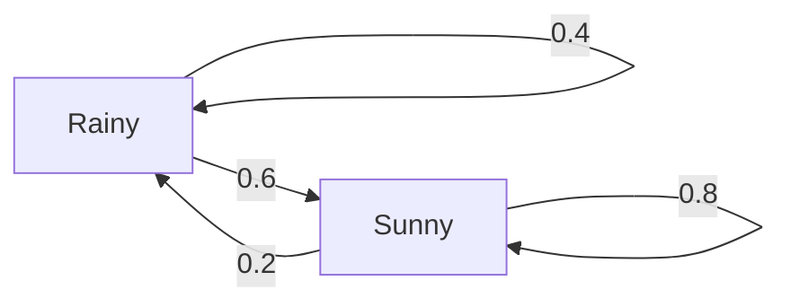

# 04 · Adding Dice: Markov Chains

*Part 2 — Planning · Based on Ch. 4 of* Reinforcement Learning: Foundations

---

## 1. Motivation: what happens if you just let it run?

Posts 02 and 03 treated randomness as a detail: when demand was uncertain, we averaged over it and moved on. But there's a question we skipped, and it matters as soon as a problem runs for more than a few steps:

> **If I keep following the same policy forever, what does my life look like on average?**

For the coffee shop: what fraction of mornings do I wake up to an empty fridge? How many days pass between two empty mornings? What's my average profit per day?

These questions have nothing to do with choosing actions. Once you **fix** a policy, the decisions disappear and what remains is a random process wandering between states. That process is a **Markov chain**, and this post is about what it does in the long run.

This is the last piece of background before MDPs (post 05). It's worth the detour because "average reward per step" appears everywhere in RL, and it's exactly what a Markov chain's long-run behaviour tells you.

---

## 2. The core idea without math

A Markov chain is the world from post 02 with the actions removed: a set of states, and a fixed probability for moving from each state to each other state.

The defining feature is the **Markov property** again: where you go next depends only on where you are now, not on how you got there.

Here's a weather model. Tomorrow's weather depends on today's:



Three questions we want answered:

1. **Where will I be in $t$ steps?** If it's rainy today, what's the chance of rain on Friday?
2. **Where do I end up in the long run?** After many steps, does the answer stop depending on today's weather?
3. **How often do I return?** On average, how many days pass between rainy days?

The remarkable fact is that for most chains, the answer to question 2 is *"the starting point stops mattering entirely."* The chain forgets where it came from and settles into a fixed proportion of time spent in each state, called the **stationary distribution**.

---

## 3. Mathematical formulation

A Markov chain is a sequence of random states $X_0, X_1, X_2, \dots$ with:

$$
\Pr(X_{t+1} = j \mid X_t = i, X_{t-1}, \dots, X_0) = \Pr(X_{t+1} = j \mid X_t = i) = p_{i,j}
$$

**The transition matrix** $P$ collects all the $p_{i,j}$ into a grid, one row per current state:

$$
P = \begin{bmatrix} 0.4 & 0.6 \\ 0.2 & 0.8 \end{bmatrix}
\qquad
p_{i,j} \ge 0, \qquad \sum_j p_{i,j} = 1 \ \text{ for every row } i
$$

**Where you are after $t$ steps.** Write the current belief about your state as a row of probabilities $p_t$. One step is a multiplication, so $t$ steps is a matrix power:

$$
p_{t+1} = p_t P \qquad\Longrightarrow\qquad p_t = p_0 P^{\,t}
\qquad\text{and}\qquad \Pr(X_t = j \mid X_0 = i) = [P^{\,t}]_{i,j}
$$

**The stationary distribution** $\mu$ is a distribution that doesn't change when you take a step:

$$
\mu = \mu P
\qquad\text{that is}\qquad
\mu_j = \sum_i \mu_i\, p_{i,j} \quad \text{for every } j
$$

**Return time.** Let $T_i$ be the number of steps to come back to state $i$ after leaving it. Then

$$
\mathbb{E}[T_i] = \frac{1}{\mu_i}
$$

**Long-run average of anything.** If each visit to state $i$ pays $f(i)$, then the average payoff per step converges to

$$
\lim_{t \to \infty} \frac{1}{t}\sum_{s=0}^{t-1} f(X_s) = \sum_i \mu_i f(i)
$$

This last one is called the **ergodic theorem**, and it's the formula behind "average reward per step."

---

## 4. Understanding the equations

- **A row of $P$** is a complete forecast from one state: *"if it's rainy today, tomorrow is 40% rainy and 60% sunny."* Rows sum to 1; columns generally don't.
- **$p_t = p_0 P^t$:** each multiplication by $P$ pushes your uncertainty forward one day. Matrix multiplication here is just "sum over all the ways to get there."
- **$\mu = \mu P$** says $\mu$ is a *fixed point*: feed it in, get it back. Compare with $V = $ Bellman's equation from post 03, which is also a fixed point. This pattern is everywhere in RL.
- **$\mathbb{E}[T_i] = 1/\mu_i$** is the most intuitive formula here. If you're in a state 25% of the time, you visit it once every 4 steps on average. *A quarter of the days are rainy ⇔ rainy days come every 4 days on average.*
- **The ergodic theorem** says a *time average* (one long run) equals a *state average* (weighted by $\mu$). You can either watch one shop for a year, or weight each fridge level by how often it occurs. Same answer.

---

## 5. When does a chain settle down? Two conditions

Not every chain forgets its starting point. The book names exactly what can go wrong.

### Problem 1: the chain can get trapped (not *irreducible*)

State $j$ is **accessible** from $i$ if you can get there eventually. Two states **communicate** if each is accessible from the other. A chain is **irreducible** if every state communicates with every other one, meaning the whole thing is one connected piece.

If it isn't, the long run depends on where you started. In this chain, states 0 and 2 are traps:

```text
  0 ←────── 1 ──────→ 2
 (stays)   50/50    (stays)
```

Start in 0 and you stay in 0. Start in 2 and you stay in 2. Start in 1 and you end up 50/50. There's no single answer, so no unique $\mu$.

States you might leave and never return to (like state 1) are called **transient**. States you're guaranteed to revisit are **recurrent**.

### Problem 2: the chain has a clock (not *aperiodic*)

Consider a chain that swaps between two states every step, with no randomness:

$$
P = \begin{bmatrix} 0 & 1 \\ 1 & 0 \end{bmatrix}
$$

Starting in state 0 the distribution goes $(1,0) \to (0,1) \to (1,0) \to \dots$ forever. It never settles, because the chain has a rhythm.

The **period** of a state is the greatest common divisor of the lengths of all loops returning to it. Here every return takes 2, 4, 6, … steps, so the period is 2. A state is **aperiodic** when that number is 1. Any self-loop (a state that can stay put) makes the state aperiodic immediately.

### The big theorem

> **Theorem (Ch. 4, Thm 4.9).** For a finite, **irreducible**, **aperiodic** Markov chain:
>
> 1. Every state is recurrent, and revisited in finite expected time.
> 2. There is a **unique** stationary distribution $\mu$, with $\mu_i > 0$ for all $i$.
> 3. $\Pr(X_t = j) \to \mu_j$ **no matter where you start**.
> 4. Time averages converge: $\frac{1}{t}\sum_{s<t} f(X_s) \to \sum_i \mu_i f(i)$.

Almost every average-reward statement in the rest of this series stands on this theorem.

---

## 6. Numerical example: the weather chain

**Forward in time.** Start rainy, $p_0 = (1, 0)$, and multiply by $P$ repeatedly:

| Day | Pr(rainy) | Pr(sunny) | Distance from $\mu$ |
|---:|---:|---:|---:|
| 0 | 1.000 | 0.000 | 0.750 |
| 1 | 0.400 | 0.600 | 0.150 |
| 2 | 0.280 | 0.720 | 0.030 |
| 3 | 0.256 | 0.744 | 0.006 |
| 4 | 0.251 | 0.749 | 0.0012 |
| 5 | 0.250 | 0.750 | 0.0002 |

Starting **sunny** instead, $p_0 = (0,1)$, gives $(0.200, 0.800) \to (0.240, 0.760) \to (0.248, 0.752) \to \dots$ — converging to the same place from the other side. The starting weather is forgotten within about a week.

**Solving for $\mu$ by hand.** Write out $\mu = \mu P$ for the rainy component and add the rule that probabilities sum to 1:

$$
\mu_R = 0.4\,\mu_R + 0.2\,\mu_S, \qquad \mu_R + \mu_S = 1
$$

Substitute $\mu_S = 1 - \mu_R$:

$$
\mu_R = 0.4\,\mu_R + 0.2(1 - \mu_R) \;\Longrightarrow\; 0.8\,\mu_R = 0.2 \;\Longrightarrow\; \boxed{\mu_R = 0.25,\quad \mu_S = 0.75}
$$

So a quarter of days are rainy, and rainy days come **every 4 days** on average ($1/0.25$).

**How fast?** Look at the last column: the distance to $\mu$ shrinks to one fifth of itself every day (0.75 → 0.15 → 0.03 → …). That shrink factor, 0.2, is the chain's *second largest eigenvalue*, here $0.4 + 0.8 - 1 = 0.2$. The book calls the number of steps needed to get close the **mixing time**. Slow-mixing chains (a maze with a narrow corridor) take much longer, and that's bad news for learning algorithms that need to see all the states.

---

## 7. Back to the coffee shop: scoring a policy in the long run

Fix a policy and the shop becomes a Markov chain: states are fridge levels, and the transitions come from the random demand. Same model as before (fridge holds 2, cartons cost \$1 and sell for \$3, demand is 1 or 2 with 50% each).

**Policy A — "fill the fridge":** order up to 2 every morning.

$$
P_A = \begin{bmatrix} 0.5 & 0.5 \\ 0.5 & 0.5 \end{bmatrix}
\qquad
\mu_A = (0.5,\ 0.5)
$$

Both rows are the same, so where you start is irrelevant after a single day. Daily profit is 2.50 from an empty fridge and 3.50 with a leftover carton, so

$$
\text{average profit} = 0.5 \cdot 2.50 + 0.5 \cdot 3.50 = \mathbf{3.00} \text{ per day}
$$

**Policy B — "bulk order":** order 2 only when the fridge is empty, otherwise order nothing.

$$
P_B = \begin{bmatrix} 0.5 & 0.5 \\ 1.0 & 0.0 \end{bmatrix}
\qquad
\mu_B = \left(\tfrac{2}{3},\ \tfrac{1}{3}\right)
$$

From a leftover carton you always sell it and wake up empty, so row 2 sends everything to state 0. Solving $\mu = \mu P$: $\mu_0 = 0.5\mu_0 + 1\cdot\mu_1$ gives $\mu_1 = 0.5\mu_0$, and with $\mu_0 + \mu_1 = 1$ we get $(\tfrac23, \tfrac13)$.

$$
\text{average profit} = \tfrac{2}{3} \cdot 2.50 + \tfrac{1}{3} \cdot 3.00 = \mathbf{2.67} \text{ per day}
$$

| | Empty mornings | Days between leftovers | Average profit/day |
|---|---:|---:|---:|
| A: fill the fridge | 50% | 2.0 | **3.00** |
| B: bulk order | 67% | 3.0 | 2.67 |

Two checks that everything lines up:

- Simulating 200,000 days gives 2.9987 and 2.6650, matching the formulas.
- Post 03 found that DP over a 30-day season earns 89.50 with policy A, which is 2.98 per day. The small gap is the end of the season, where leftovers become worthless.

**This is the bridge to post 05:** an MDP plus a policy *is* a Markov chain, and $\sum_i \mu_i r(i)$ scores that policy. Choosing between policies A and B is exactly what the planning algorithms do.

---

## 8. Practical implementation

The full script is [`code/04_markov_chains.py`](code/04_markov_chains.py). You don't need a linear algebra library: one step of the chain is a weighted sum, and repeating it finds $\mu$ (this is *power iteration*).

```python
def step_distribution(p, P):
    """p_next[j] = sum_i p[i] * P[i][j]"""
    return [sum(p[i] * P[i][j] for i in range(len(p))) for j in range(len(p))]

def stationary(P, tol=1e-12):
    p = [1 / len(P)] * len(P)               # start anywhere
    while True:
        q = step_distribution(p, P)
        if max(abs(a - b) for a, b in zip(p, q)) < tol:
            return q                        # p stopped changing: p = pP
        p = q

WEATHER = [[0.4, 0.6],
           [0.2, 0.8]]
print(stationary(WEATHER))                  # [0.25, 0.75]
```

Notice what this loop is: **apply the same operator over and over until nothing changes**. Value iteration in post 06 has exactly this shape, and for the same underlying reason.

---

## 9. Assumptions and limitations

- **Finite states.** With infinitely many states, a chain can be *recurrent* but take forever on average to come back (the book's *null recurrent*), or wander off and never return (*transient*). The classic example is a coin-flip walk on the integers: you return to the start with probability 1, but the expected wait is infinite. Finite chains never have this problem.
- **Fixed rules.** $P$ must not change over time. A shop whose customers grow year after year isn't described by one fixed chain.
- **Both conditions are needed.** Without irreducibility the answer depends on the start; without aperiodicity there's no limit at all. (Time averages still work for periodic chains, which is why the ergodic theorem is the more robust tool.)
- **Mixing time can be brutal.** The theorem says the chain converges, not that it converges *soon*. A chain that rarely crosses between two halves of its state space may take astronomically long.
- **Skipped:** *reversible* chains and the detailed balance equations (Ch. 4.3.1), a useful shortcut for finding $\mu$ in queues and physics models, and the basis of MCMC methods.

---

## Key takeaways

1. A **Markov chain** is a set of states plus a transition matrix $P$; where you go next depends only on where you are.
2. Uncertainty moves forward by multiplication: $p_t = p_0 P^t$.
3. The **stationary distribution** solves $\mu = \mu P$: the fraction of time spent in each state, once the chain has forgotten where it started.
4. **$\mathbb{E}[T_i] = 1/\mu_i$:** states you occupy a quarter of the time are revisited every 4 steps.
5. A finite chain that is **irreducible** (one connected piece) and **aperiodic** (no clock) has a unique $\mu$, converges to it from anywhere, and makes time averages equal $\sum_i \mu_i f(i)$.
6. **A policy turns a decision problem into a Markov chain**, and $\sum_i \mu_i r(i)$ is that policy's long-run score.

---

## Connection to the bigger picture

We now have both halves of the picture. Post 03 gave us dynamic programming, the way to choose actions by working backwards. This post gave us Markov chains, the way randomness plays out over time. Put the actions back into the chain and you get the model that the rest of the book is about.

**Next post (05): MDPs and the Value of a Situation.** We'll define the Markov Decision Process properly, define $V^\pi(s)$ and the Q function $Q^\pi(s,a)$, and use backward DP to solve a stochastic problem exactly.

```text
01 What is RL? ──► 02 Policies ──► 03 Dynamic programming ──► [04 Markov chains] ──► 05 MDPs ──► …
                                                                you are here
```
